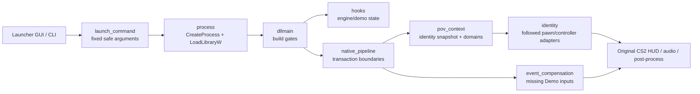

# Architecture

CS2 Demo Live HUD separates release policy, process control, low-level hook mechanics, shared POV identity, and individual native HUD transactions. The central rule is that Demo state remains real; only an explicitly scoped original CS2 transaction receives live-style local-player semantics.

## Runtime flow

## Modules

### Launcher

| Module | Responsibility |
|---|---|
| `launcher/main.cpp` | Win32 window, file selection, launch state, CLI compatibility |
| `launcher/launch_command.*` | Single source of truth for fixed arguments, optional `+playdemo`, and the GUI command summary |
| `launcher/cs2_locate.*` | Installation discovery and running-process guard |
| `launcher/process.*` | cfg generation, process creation, engine readiness wait, `LoadLibraryW` injection |

The launcher owns the release defaults. It always sets `LIVE_HUD_PIPELINE=1`, always uses `-insecure`, and never injects into an already-running `cs2.exe`.

### Shared native infrastructure

| Module | Responsibility |
|---|---|
| `common/build_id.*` | Read and compare PE `TimeDateStamp` / `SizeOfImage` |
| `common/paths.*` | Demo normalization and module-relative log paths |
| `common/log.*` | Serialized line logging from hooks and watcher threads |
| `dll/detour.*` | Reversible x64 entry detours and relative-call trampolines |
| `offsets/current.h` | All supported-build fingerprints, RVAs, layouts, and expected bytes |

### Pipeline V2

| Module | Responsibility |
|---|---|
| `dll/pov_context.*` | Atomically published followed-player snapshot, thread-local domain scopes, temporary death identity pin |
| `dll/identity.*` | Follow-target discovery and the audited pawn/controller/mode adapters consumed inside scopes |
| `dll/native_pipeline.*` | Installation transaction and complete radar, voice, communications, effects, HUD, sound and combat boundaries |
| `dll/event_compensation.*` | Pure policy for kill rewards, throw notices, radar-sound fallback/dedupe, and death-message pairing |
| `dll/hooks.*` | Engine build gate, Demo seek state, filtered research hooks retained outside the formal Pipeline path |

## Invariants

1. Fixed-RVA work starts only after both module fingerprints match.
2. Required hook installation is transactional: any failure restores every previously installed entry.
3. `pov::Scope` is the only authority for live-style identity exposure.
4. A scope covers a complete original transaction, not a final UI leaf or a guessed stack window.
5. Event compensation never draws Panorama UI and never mutates real player economy/state.
6. Native input wins over reconstructed input; short dedupe windows prevent double presentation.
7. The launcher and GUI read their fixed command policy from `launch_command.*`.

## Updating for a CS2 release

1. Record fresh `engine2.dll` and `client.dll` PE fingerprints.
2. Audit every fixed RVA, expected prologue/call byte, object layout, and vtable slot used by `offsets/current.h`.
3. Update fingerprints only after all boundaries pass the audit scripts.
4. Build Release and run all unit tests.
5. Exercise Demo launch, manual launch, seek, POV switch, damage and death in a local `-insecure` session.
6. Review `logs/cs2-demo-live-hud.log` for build gates, transaction commit, rollback, and runtime boundary evidence.
7. Update README compatibility data and CHANGELOG before tagging a release.
